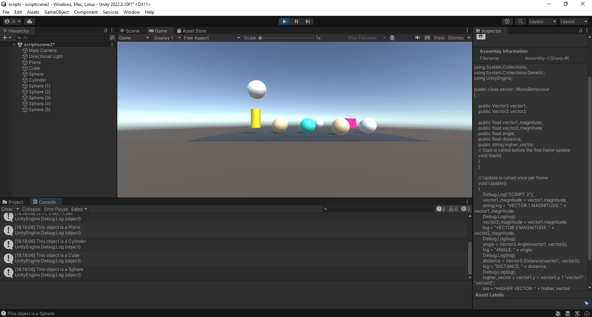

Eva Peso Adán (alu0101398037@ull.edu.es)

# Scripts
## Ejercicio 1
Crea un script asociado al cubo que inicialice un array a un conjunto de valores numéricos aleatorios entre 0 y 25. En cada frame se debe cambiar una posición aleatoria y mostrar en pantalla en la consola los que sean mayores que 15. Parametrizar el rango para poderlo cambiar desde el inspector.

## Ejercicio 2
Crea una escena simple en la que ubiques un plano y sobre él un cubo, una esfera y un cilindro. Cada uno de los objetos debe estar en un color diferente. En la consola cada objeto debe mostrar su nombre.

## Ejercicio 3
Crea un script asociado a la esfera con dos variables Vector3 públicas. Dale valor a cada componente de los vectores desde el inspector. Muestra en la consola:
* La magnitud de cada uno de ellos. 
* El ángulo que forman
* La distancia entre ambos.
* Un mensaje indicando qué vector está a una altura mayor.
Muestra en el inspector cada uno de esos valores.

## Ejercicio 4
Muestra en pantalla el vector con la posición de la esfera.

## Ejercicio 5
Crea un script para la esfera que muestre en consola la distancia a la que están el cubo y el cilindro.

## Ejercicio 6
Crea un script que alinee el cilindro y el cubo con la esfera, 5  unidades a derecha e izquierda respectivamente en el eje X. Prueba a cambiar a cambiar la coordenada x de la posición de la esfera en el Inspector de Objetos.

## Ejercicio 7
Cambia el color del cilindro cuando el usuario pulse la tecla A, cambia el color del cubo cuando el usuario pulse la flecha arriba.

## Ejercicio 8
Agrega 5 esferas más en la escena. Crea un grupo de 2 , asígnales la misma etiqueta y a las restantes otra etiqueta diferente a ésta. Crea un vector con las distancias de cada una de las del segundo grupo al cubo. Sube en altura (aumenta la y) de la esfera más cercana. Cambiar color de la más lejana cuando el jugador pulsa la tecla espacio.
##
