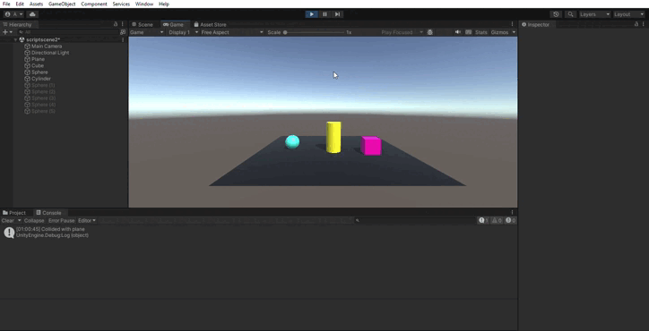
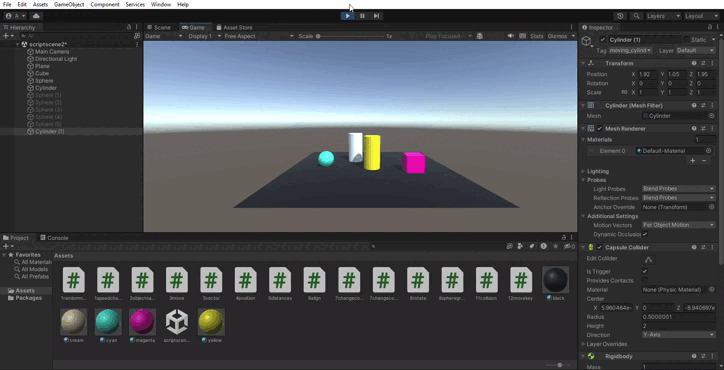

Eva Peso Adán (alu0101398037@ull.edu.es)
# Física
## Ejercicio 1
Agrega un campo velocidad al cubo de la práctica anterior y asígnale un valor que se pueda cambiar en el inspector de objetos. Muestra la consola el resultado de multiplicar la velocidad por el valor del eje vertical y por el valor del eje horizontal cada vez que se pulsan las teclas flecha arriba-abajo ó flecha izquierda-derecha. El mensaje debe comenzar por el nombre de la flecha pulsada.

## Ejercicio 2
Mapea la tecla H a la función disparo.

## Ejercicio 3

Crea un script asociado al cubo que en cada iteración traslade al cubo una cantidad proporcional un vector que indica la dirección del movimiento: moveDirection que debe poder modificarse en el inspector.  La velocidad a la que se produce el movimiento también se especifica en el inspector, con la propiedad speed. Inicialmente la velocidad debe ser mayor que 1 y el cubo estar en una posición y=0. En el informe de la práctica comenta los resultados que obtienes en cada una de las siguientes situaciones:

a. duplicas las coordenadas de la dirección del movimiento - Nada, ya que no afecta a la velocidad (el vector está normalizado). Si no estuviera normalizado, afectaría a la velocidad.

b. duplicas la velocidad manteniendo la dirección del movimiento - El cubo se mueve más rápido.

c. la velocidad que usas es menor que 1 - El cubo se mueve más lento.

d. la posición del cubo tiene y>0 - Se queda fijo en el aire en la posición indicada.

e. intercambiar movimiento relativo al sistema de referencia local y el mundial - En este caso, no ocurre nada.

## Ejercicio 4
Mueve el cubo con las teclas de flecha arriba-abajo, izquierda-derecha a la velocidad speed. Cada uno de estos ejes implican desplazamientos en el eje vertical y horizontal respectivamente. Mueve la esfera con las teclas w-s (movimiento vertical) a-d (movimiento horizontal).

## Ejercicio 5
Adapta el movimiento en el ejercicio 4 para que sea proporcional al tiempo transcurrido durante la generación del frame.

## Ejercicio 6
Adapta el movimiento en el ejercicio 5 para que el cubo se mueva hacia la posición de la esfera. Debes considerar, que el avance no debe estar influenciado por cuánto de lejos o cerca estén los dos objetos.

## Ejercicio 7
Adapta el movimiento en el ejercicio 6 de forma que el cubo gire hacia la esfera. Realiza pruebas cambiando la posición de la esfera mediante las teclas awsd.

## Ejercicio 8
Utilizar el eje “Horizontal” para girar el objetivo y que avance siempre en la dirección hacia adelante.

## Ejercicio 9
Configura el cilindro como un objeto físico, cuando el cubo o la esfera colisionen con él se debe mostrar un mensaje en consola con la etiqueta del objeto que haya colisionado.

## Ejercicio 10
Configura el cubo como un objeto cinemático y la esfera como un objeto físico. Adapta los scripts del ejercicio 9 para obtener el mismo comportamiento.

## Ejercicio 11
Configura el cilindro como un objeto de tipo Trigger. Adapta los scripts de los ejercicios anteriores para obtener el mismo comportamiento.

## Ejercicio 12

Agrega un cilindro de un color diferente al que ya hay en la escena y configúralo como un objeto físico. Selecciona un conjunto de teclas que te permitan controlar su movimiento por la escena y prográmale un movimiento que permita dirigirlo hacia la esfera. Prueba diferentes configuraciones de la esfera física con masa 10 veces mayor que el cilindro, física con masa 10 veces menor que el cilindro, cinemática y trigger. También prueba la configuración del cilindro de forma que su fricción se duplique o no. Explica en el informe todos los resultados posibles.

a. Esfera con 10 veces más masa que cilindro (ambos físicos)

Al cilindro le cuesta mover la esfera.

b. Cilindro con 10 veces más masa que esfera (ambos físicos)

Ahora el cilindro lo tiene más fácil para tirar la esfera.

c. Cinemática

Ahora el cilindro no es movido por el motor de física.

d. Trigger

Ahora el cilindro no colisiona.

e. Con fricción (0.6)

f. Con fricción (1.2)

Se puede ver que la fricción afecta al golpe que recibe la esfera, así como el movimiento del cilindro.
