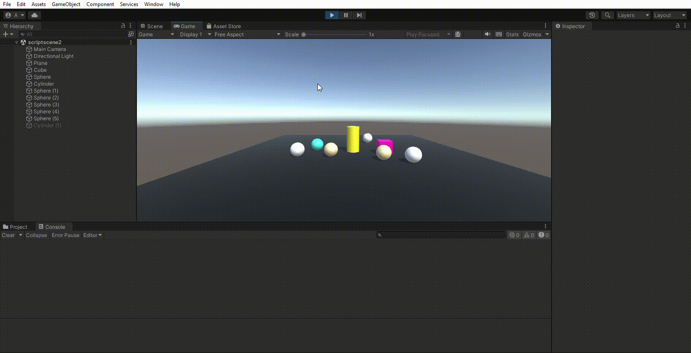
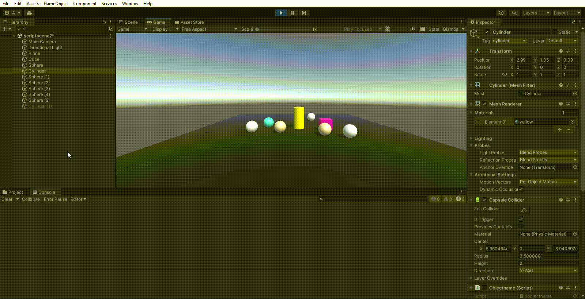
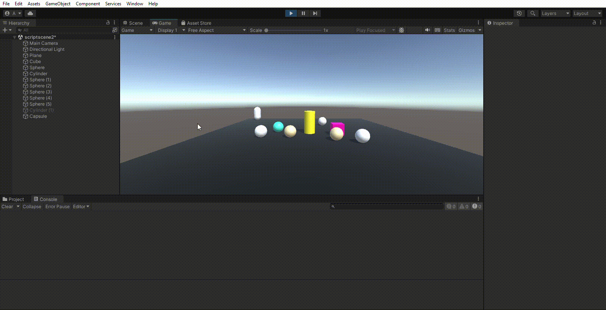
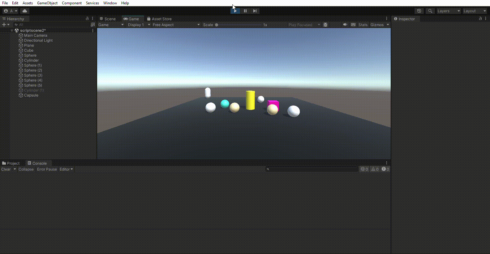
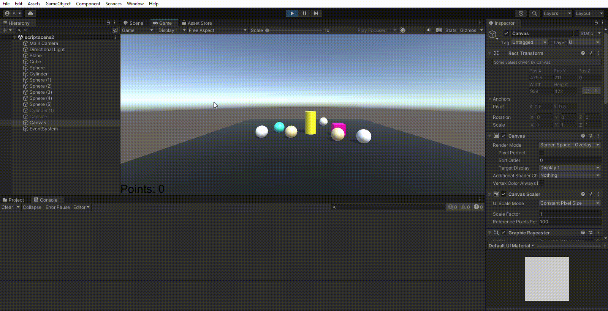
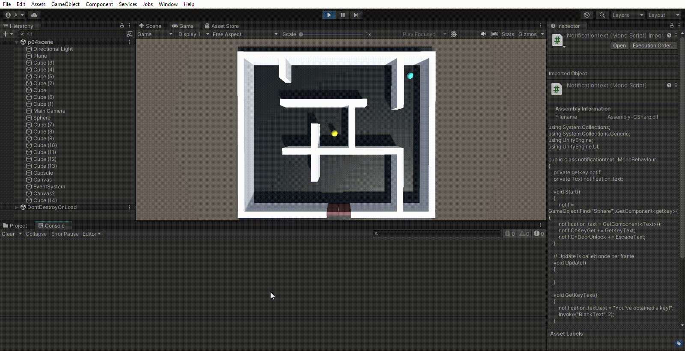

Eva Peso Adán (alu0101398037@ull.edu.es)
# Eventos
## Ejercicio 1
A partir de la escena que has estado utilizando en las últimas prácticas, crea la siguiente mecánica. Cuando el cubo colisiona con el cilindro, las esferas de tipo 1 cambian su color y las esferas de tipo 2 se desplazan hacia el cilindro.

## Ejercicio 2
Adapta la escena anterior para que cuando el cubo colisiona con cualquier objeto que no sean esferas del grupo 1, las esferas en el grupo 1 se acercan al cilindro. Cuando el cubo toca cualquier esfera del grupo 1, las esferas del grupo 2 aumentan de tamaño.

## Ejercicio 3
Cuando el cubo se aproxima al cilindro, las esferas del grupo 1 cambian su color y saltan y las esferas del grupo 2 se orientan hacia un objeto ubicado en la escena con ese propósito

## Ejercicio 4
Implementar la mecánica de recoger esferas en la escena que actualicen la puntuación del jugador. Las esferas de tipo 1 suman 5 puntos y las esferas de tipo 2 suman 10. Mostrar la puntuación en la consola.

## Ejercicio 5
Partiendo del script anterior crea una interfaz que muestre la puntuación que va obteniendo el cubo.

## Ejercicio 6
Genera una escena que incluya elementos que se ajusten a la escena del prototipo y alguna de las mecánicas anteriores.

