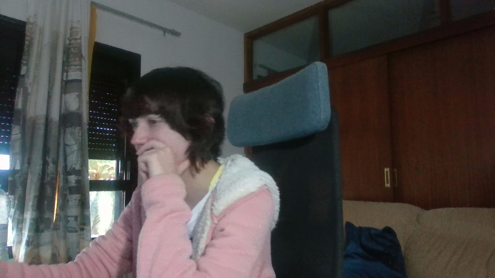

Eva Peso Adán (alu0101398037@ull.edu.es)
# Micrófono y cámara
## Ejercicio 1
En la escena del zombi, hacer que Unity reproduzca un sonido cuando el zombie alcanza a una araña.

El vídeo mp4 mostrando que se reproduce el sonido se encuentra en la carpeta "vid" de este repositorio ("ejercicio1.mp4").

## Ejercicio 2
En una escena nueva, hacer que un altavoz pueda grabar y reproducir sonidos provenientes del micrófono, así como poder pausar la grabación.

El vídeo mp4 mostrando que se reproduce el sonido se encuentra en la carpeta "vid" de este repositorio ("ejercicio2.mp4").

## Ejercicio 3
En la misma escena anterior, hacer que una pantalla enseñe lo que capta una cámara, y que además se pueda pausar la imagen y sacar un snapshot del frame actual.

El snapshot sacado fue el siguiente:

