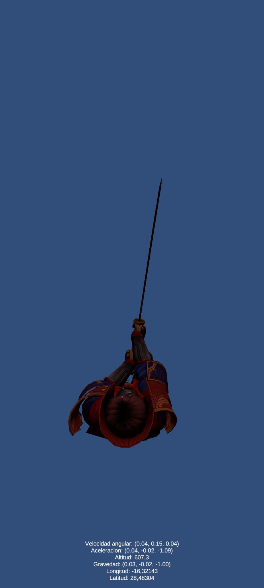

Eva Peso Adán (alu0101398037@ull.edu.es)
# Sensores
El objetivo de esta práctica es hacer que el samurái apunte siempre al norte con su espada, y que el programa muestre la información obtenida de los sensores.

## Prueba en el centro de cálculo

## Prueba en la subida al parking de la ESIT

