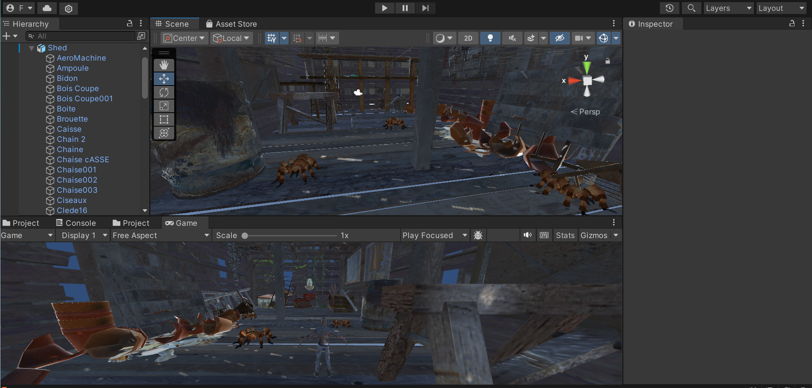
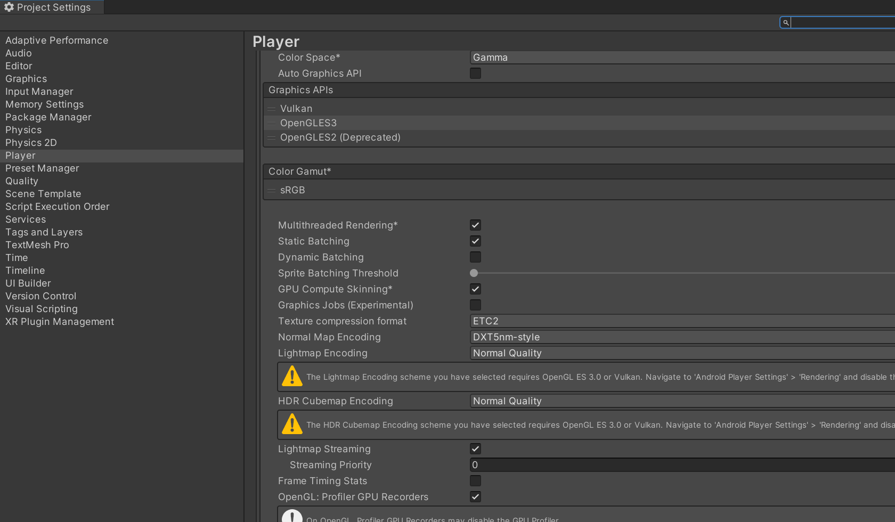
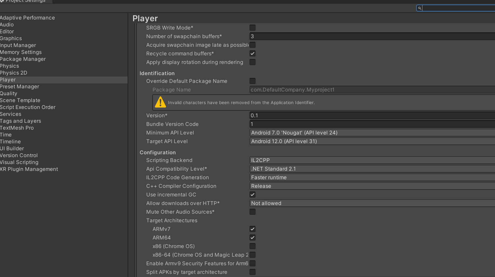
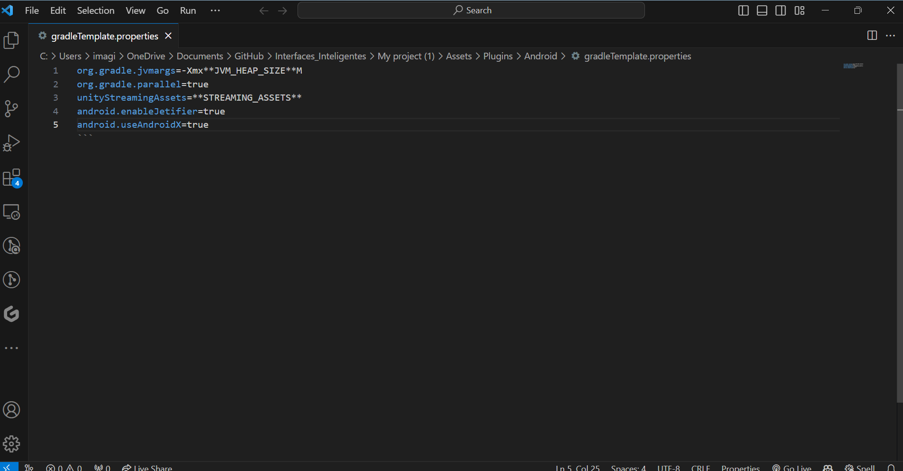
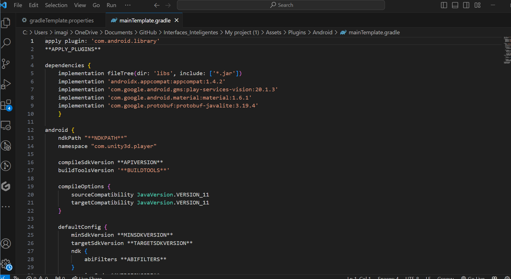

Eva Peso Adán (alu0101398037@ull.edu.es)

# Prueba Interfaces Inteligentes

## Ejercicio 1
Crear una escena en la que el entorno se construya con el paquete The Shed de la Asset Store. Debes incluir al menos 3 arañas del paquete Free Fantasy Spider distribuidas por toda la habitación. Incluir un personaje del paquete Hungry Zombie.

## Ejercicio 2
Crear un script que actúe de controlador del movimiento del Zombie, avanzando siempre hacia delante del eje Z.

## Ejercicio 3
Crear un script para teletransportar al monstruo a cada vez que se pulse la tecla T.

## Ejercicio 4
Crear un script que desplace aleatoriamente las macetas cada vez que el monstruo esté a una distancia que fijes de la pizarra y le acerque las sillas una distancia prefijada.

## Ejercicio 5
Crear un script que al alcanzar el monstruo alguna silla todas las arañas se dirijan a él.

## Ejercicio 6
Configurar el proyecto para funcionar con CardBoard.

## No finalizados
Ejercicio 7 (a medias) y la modificación.
